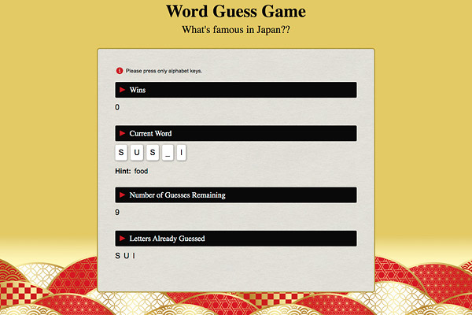

# Word Guess Game

### Overview
Word Guess Game will run in the browser, and features dynamically updated HTML and CSS powered by JavaScript code.

### Links
- [Link to the page](https://yuda0110.github.io/Word-Guess-Game/)
- [Link to the code](https://github.com/yuda0110/Word-Guess-Game)

### Tech/framework used

- HTML
- CSS
- JavaScript

### How to play?
Press any key to get started!

As the player guesses the correct letters, reveal them.

The player can guess only limited number of letters.

After the player wins/loses the game will automatically choose another word for the player to continue playing the game.